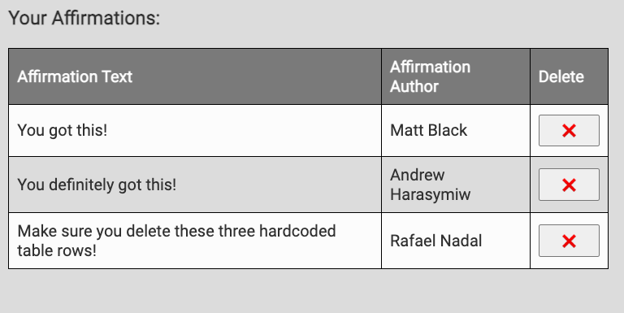

# JavaScript Affirmation App Group Project
Please remember that the goal of these group projects is to work together. Between these two possible outcomes:

1. All three parts were completed. Two group members are unsure how one or more features were implemented.
2. Just the first two parts were completed. All group members have an understanding of how these features were implemented.

Outcome #2 is **100% preferable**.

## Required Features:

Be sure to do these in order: No moving on to **Part Two** if you haven't finished **Part One**.

##### Part One:
* Users can click on the fire emoji button to add a fire emoji to the DOM.
* Users can click on the ice emoji button to add an ice emoji to the DOM.

##### Part Two:
* Users can fill out the two inputs and click submit to add a positive affirmation to the table.
* Note: Be sure to delete the *hardcoded*  table rows from `index.html` once you have this part working.

##### Part Three:
* Users should have the ability to delete positive affirmations from the table.
* Note: Recommended visual appearance of this feature:

## Stretch Goals:

ONLY If you complete the above features and *everyone* on your team is feeling good about the code!
Your app needs to implement conditional logic based on the count of 🔥 and ❄️ emojis that exist on the DOM:
    - A user cannot create a new affirmation unless 🔥 > ❄️.
    - A user cannot delete an affirmation unless ❄️ > 🔥.

Alternatively, take some time to style this app and make it beautiful.
  - Note: There's already some basic CSS implemented, including an example of using flexbox to create a minimal header/main/footer layout.
